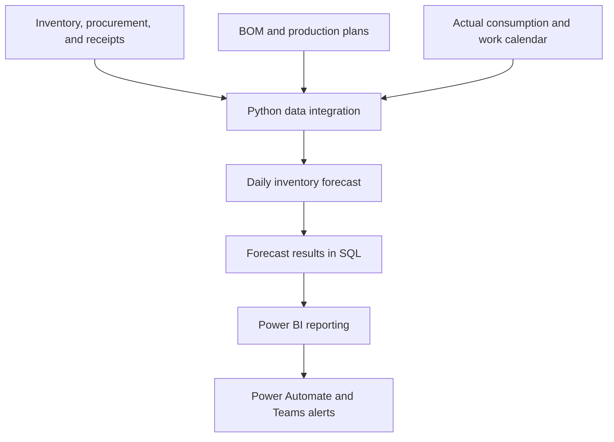

**English** | [繁體中文](README_ZH-TW.md)

# Raw Material Inventory Forecasting and Alert System

Extended raw-material planning from a current-stock view to a forward-looking supply-and-demand forecast, giving procurement, production, and management teams a shared basis for replenishment and risk decisions. The system integrates inventory, procurement, bill of materials (BOM), and production-plan data to forecast daily receipts, consumption, and stock for the next three months. It covers more than **50 raw materials** with a monthly cost base of approximately **NT$1 billion** and issues tiered alerts for early action.

## Project Overview

| Item | Description |
|---|---|
| Business domain | Raw-material procurement, inventory, and production planning |
| My role | Data integration, forecasting logic, Power BI reporting, alert workflow |
| Coverage | More than 50 raw materials |
| Cost base | Approximately NT$1 billion per month |
| Forecast horizon | Next three months, updated daily |

## Business Challenge

Inventory, procurement status, actual consumption, BOM, and production plans were distributed across different systems. Current inventory alone could not show whether future receipts would meet production demand, while late identification of a shortage reduced the time available for purchasing and schedule adjustments.

## Approach

1. Integrated on-hand and restricted inventory, purchase orders, inbound schedules, BOM, production plans, and actual consumption.
2. Aligned all sources by material and date.
3. Estimated daily consumption using near-term production schedules and medium-term plans.
4. Added planned receipts and inventory movements to calculate future daily balances.
5. Assigned alert levels based on safety thresholds and expected shortage dates.
6. Presented trends, risk lists, and daily detail in Power BI and issued daily Teams notifications.

## Core Logic

```text
Available inventory = Total inventory - Restricted inventory
```

```text
Forecast inventory today = Forecast inventory yesterday + Receipts today - Consumption today
```

| Forecast period | Consumption basis |
|---|---|
| Next week | BOM and actual production schedule |
| Remainder of current month | BOM, weekly production plan, and working days |
| Following months | BOM, monthly production plan, and working days |

## Architecture



See the [detailed system architecture](docs/architecture_en.md) for component responsibilities and the forecasting data flow.

## My Contributions

- Integrated raw-material, procurement, inventory, BOM, and production data across systems.
- Built daily inventory movement and shortage-detection logic in Python.
- Designed the analytical data model used by Power BI.
- Developed inventory trends, risk lists, and drill-down detail pages.
- Converted forecast results into actionable information for procurement, production, and management teams.

## Key Outcomes

- Covers more than **50 raw materials** with a monthly cost base of approximately **NT$1 billion**.
- Provides a daily inventory forecast for the next three months.
- Establishes a shared planning view across procurement, production, and management.
- Uses tiered alerts to support early action on potential shortages.

## Dashboard Views

### Inventory Forecast Trend


Shows current inventory, expected receipts, forecast consumption, and safety thresholds to identify potential shortage dates.

### Inventory Risk Alerts


Summarizes materials requiring attention and their alert levels.

### Near-Term Shortage Alerts


Lists materials at near-term risk, expected shortage dates, and handling priority.

### Daily Forecast Detail


Provides daily inventory, receipts, consumption, and forecast balances for root-cause analysis.

## Technology

Python, Pandas, SQL, relational databases, Power BI, Power Automate, and Teams.

## Confidentiality

This case study presents de-identified business logic and dashboard design only. It excludes proprietary data, connection details, internal table names, complete business rules, and a directly reproducible runtime environment.
