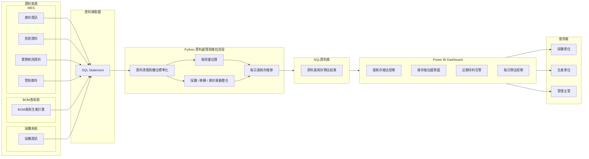

# 原料進耗存預測與庫存告警系統

這是一個用於製造業原料管理的資料分析與決策支援專案。系統整合庫存、採購、耗用、BOM 與生產計畫等資料，透過 Python 建立每日進耗存推估邏輯，並以 Power BI Dashboard 呈現未來庫存趨勢、缺料風險與庫存告警，協助採購、生產與管理單位提前掌握原料風險。

本 repository 作為作品集展示用途，重點放在**問題定義、系統架構、資料流程、預測邏輯與 Dashboard 設計**。由於正式環境涉及多個內部系統、資料庫與業務規則，本公開版本不提供可直接執行的完整資料與環境設定。

---

## 專案背景

在不鏽鋼製造業中，原料成本通常占整體生產成本很高的比例。若原料庫存過低，可能造成生產中斷與緊急採購，推升成本；若庫存過高，則會增加營運資金與倉儲壓力。因此，管理單位需要一套可以持續追蹤原料庫存、預估未來耗用、掌握採購到貨進度，並提前發出缺料風險提醒的系統。

此專案的目標是將原本分散在不同系統與報表中的資料整合起來，建立一套可持續更新的原料進耗存預測流程，讓採購、生產與管理單位能夠用同一份資料基礎進行決策。

---

## 解決的問題

本專案主要解決以下管理問題：

- 原料資料分散在不同系統，人工彙整耗時且容易出錯。
- 採購、庫存、實際耗用與預估耗用之間缺乏整合視角。
- 管理者難以快速判斷未來幾週或幾個月是否會發生缺料。
- 單純看目前庫存不足以支援採購決策，必須同時考慮未來進貨與生產需求。
- 缺料風險若太晚發現，會壓縮採購與生產排程調整時間。

---

## 我的角色

我在此專案中主要負責資料流程與分析應用的設計與實作，包含：

- 整合原料庫存、採購、實際耗用、預估耗用與 BOM 相關資料。
- 使用 Python 建立資料處理、庫存推移與缺料判斷流程。
- 將預測結果整理成可供 Dashboard 使用的資料結構。
- 使用 Power BI 設計管理視角的庫存趨勢、庫存告警與明細查詢頁面。
- 將分析結果轉化為採購、生產與管理單位可採取行動的資訊。

---

## 系統架構



---

## 資料流程說明

系統會將不同來源的資料整理成一致的分析基礎，並依照每日時間序列推算未來庫存變化。

| 階段 | 說明 |
| --- | --- |
| 資料擷取 | 透過 SQL 查詢庫存、採購、實際耗用、BOM、生產計畫與作業日曆等資料。 |
| 資料整理 | 使用 Python 清理欄位、統一資料格式，並將不同來源的資料對齊到原料與日期維度。 |
| 耗用估算 | 根據 BOM、生產計畫與歷史耗用資料，推估未來各原料的預期耗用量。 |
| 庫存推移 | 以目前庫存為起點，逐日加入預計進貨、移轉、實際耗用與預估耗用，計算未來每日庫存。 |
| 風險判斷 | 比對安全水位、管制庫存與未來需求，標示低庫存與近期待料風險。 |
| 視覺化 | 將結果輸出至 Power BI，提供趨勢追蹤、告警清單與明細查詢。 |

---

## Dashboard 展示

### 1. 庫存預測趨勢


此頁面用於追蹤單一原料在未來期間的庫存變化。管理者可以同時觀察目前庫存、預計進貨、預估耗用與安全水位，快速判斷庫存是否會在未來某個時間點跌破警戒線。

這個畫面的核心價值是將「目前是否足夠」轉換成「未來是否會不足」，讓採購與生產單位可以提前協調進貨、替代料或排程調整。

---

### 2. 庫存量過高警示


此頁面彙整各原料目前與未來的庫存風險，協助使用者快速找出需要優先關注的原料項目。相較於逐項查看明細，告警頁面可以讓管理者直接聚焦在異常與風險較高的材料。

這類告警用於例行管理會議、採購追蹤會議，以及跨部門協調時的共同事實基礎。

---

### 3. 斷料警示


此頁面聚焦於近期可能發生的缺料或待料風險。系統將未來短期內的庫存推移結果轉換成告警清單，使採購與生產單位能夠優先處理即將影響排程的項目。

這個畫面的設計重點不是呈現所有資料，而是讓使用者快速回答：「哪些原料最急？影響時間點在哪裡？需要誰處理？」

---

### 4. 每日預估矩陣


此頁面將每日庫存、進貨、耗用與預估結果整理成矩陣形式，適合進一步追查單一原料在不同日期的變化原因。當趨勢圖或告警頁面發現異常時，使用者可以透過此頁面回到日別明細，確認風險來源。

矩陣頁面提供較細的資料粒度，支援採購追蹤、排程討論與異常分析。

---

## 專案成果

- 建立原料進耗存推移模型，整合庫存、採購、實際耗用與預估耗用資料。
- 支援多月期庫存預測，協助採購與生產單位提前掌握缺料風險。
- 建置 Power BI Dashboard，提供趨勢追蹤、庫存告警、近期待料告警與每日明細查詢。
- 將分散資料轉換成可行動的管理資訊，降低人工彙整成本並提升決策效率。
- 監控 50 項以上關鍵原料，涵蓋每月約 NT$10 億級別的原料管理規模。

---

## 技術

- **Python**：資料清理、資料整合、庫存推移與風險判斷。
- **SQL**：來源資料查詢與資料抽取邏輯整理。
- **Power BI**：Dashboard 視覺化、趨勢分析、告警清單與明細查詢。
- **資料模型設計**：將採購、庫存、耗用與生產計畫整合至可分析的日期與原料維度。

---

## Repository 結構

```text
Material_Forecasting_System/
├── dashboard/
│   ├── 01_inventory_forecast_trend.jpg
│   ├── 02_inventory_volume_alert.jpg
│   ├── 03_near_term_stockout_alert.jpg
│   └── 04_daily_forecast_matrix.jpg
├── scripts/
│   ├── config.py
│   ├── data.py
│   ├── main.py
│   ├── model.py
│   └── utils.py
└── sql_templates/
    ├── README.md
    ├── actual_consumption.sql
    ├── bom.sql
    ├── bom_version_info.sql
    ├── controlled_inventory.sql
    ├── internal_transfer.sql
    ├── inventory_snapshot.sql
    ├── operation_calendar.sql
    ├── procurement_arrangement.sql
    ├── procurement_tracking.sql
    └── production_plan_week.sql
```

---

## 關於公開版本

本 repository 為作品集版本，主要用於展示專案架構、分析邏輯與 Dashboard 設計。正式環境中的資料來源包含多個內部系統與資料庫，且涉及公司內部資料、業務規則與系統設定，因此不提供完整資料集與可直接重現的執行環境。

公開版本保留的是可展示的核心設計：如何定義管理問題、如何整合多來源資料、如何推估未來庫存，以及如何將結果轉化成可供跨部門使用的 Dashboard。
