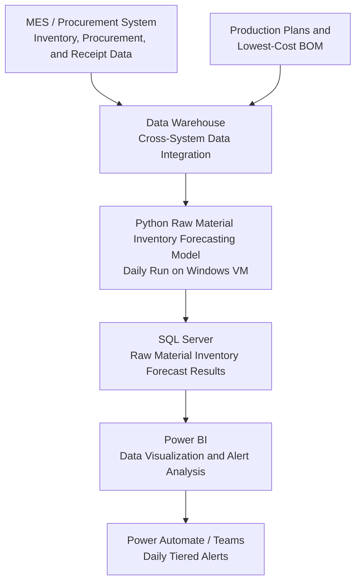

**English** | [繁體中文](README_ZH-TW.md)

# Raw Material Inventory Forecasting and Stockout Alert System

This project integrates cross-system data to forecast daily changes in future raw-material inventory, enabling early identification of potential material shortages and timely response actions.

## Purpose

For the lowest-cost BOM to be successfully implemented, not only the [Lowest-Cost BOM Data and Decision Platform](https://github.com/ChienChienChien/BOM_Management_Platform/blob/main/README.md) must provide a stable data foundation, but also the lowest-cost BOM must be exactly executated in producting operation.

By integrating inventory, purchase orders, inbound deliveries, production plans, and BOM data, the project establishes a daily inventory forecast and tiered alerting mechanism for the next three months. This enables collaborate teams to expedite materials or adjust production plans in advance to meet the raw-material requirements of the lowest-cost BOM.

## Outcomes

The system is live and runs daily, transforming raw material management from a periodic manual process into a decision workflow based on daily data refreshes, rolling forecasts, and exception alerts.

### Identify Stockout Risks with Tiered Alerts

💡 Convert stockout risks into clear handling priorities

The system classifies risk urgency based on the expected stockout date:

- **15-day alert:** There is still time to close the projected gap through procurement, supplier follow-up, or expedited delivery.
- **3-day alert:** A stockout is imminent and requires immediate expediting or production rescheduling.

<table>
  <tr>
    <td align="center" width="35%">
       
      Inventory exception alert
    </td>
    <td align="center" width="65%">
       
      Near-term stockout alert: shows at-risk materials, expected stockout dates, and handling priorities
    </td>
  </tr>
</table>

### Raw Material Inventory Forecast Matrix

💡 Build a daily view of raw material movements for the next three months

It consolidates expected daily raw material delivery, forecast consumption, and inventory into a single matrix, using color coding to flag warning and shortage conditions so users can quickly identify at-risk raw materials and the dates on which issues will occur.

Orange indicates that forecast inventory is below the alert threshold for the day (set to 200 in this example); red indicates that forecast inventory is below zero.

Some raw materials must undergo trial melting, composition verification, and release procedures after receipt before they can be used in production. Reviewing book inventory alone may therefore suggest that quantity is sufficient even though the material has not yet been released when production needs it.
To reflect these operational requirements, the project defines two management metrics—Total Inventory and Available Inventory—so the forecast matrix follows actual material-management logic.

<table>
  <tr>
    <td align="center" width="100%">
       
    </td>
  </tr>
</table>

### Inventory Forecast Trend

💡 Identify when inventory gaps are expected to emerge

Current inventory, planned receipts, forecast consumption, and safety stock are displayed on a single timeline, enabling users to understand inventory movements and identify when a shortage is expected to develop.

<table>
  <tr>
    <td align="center" width="100%">
       
    </td>
  </tr>
</table>

### Replace Manual Preparation with Daily Automated Monitoring

Previously, one employee spent approximately three hours each week preparing data and forecasting inventory. The system now completes data extraction, supply-and-demand forecasting, result updates, and Teams alert distribution automatically every day, with no manual initiation required.

It currently covers more than 50 raw materials representing approximately NT$1 billion in monthly material costs and continuously supports material supply and production scheduling decisions.

## Approach

### 1. Define the Raw Material Forecast Matrix and Data Sources

Together with the collaborating teams, I defined the business logic for receipts, consumption, and inventory. I also reviewed data sources including MES, the procurement system, production plans, and the lowest-cost BOM, clarifying update frequencies, date fields, and business definitions so that data from different systems could be aligned in a single forecast matrix.

| Matrix Field | Data or Calculation Basis | Analytical Purpose |
|---|---|---|
| Opening Inventory | Current inventory quantity and material status (MES) | Establish the starting point for the inventory forecast |
| Receipts | Purchase quantity and expected receipt date (MES and procurement system) | Estimate future replenishment |
| Consumption | Production plans and lowest-cost BOM explosion results | Estimate raw material demand by date |
| Total Inventory | Daily calculation based on opening inventory, planned receipts, and forecast consumption | Determine whether the overall material quantity is sufficient |
| Available Inventory | Total inventory less quantities still subject to inspection or release controls | Determine whether the material can actually be used in production |

### 2. Integrate Data and Build the Raw Material Inventory Forecasting Model

In collaboration with IT, I integrated inventory, purchase order, and receipt data from MES and the procurement system into the Data Warehouse. I then implemented the receipts, consumption, and inventory business logic in Python to build the raw material inventory forecasting model.
Each day, the Python program retrieves the latest data, adds planned receipts and deducts forecast consumption in chronological order, rolls the daily inventory forecast forward for the next three months, and writes the results to SQL Server.

Because some raw materials must undergo trial melting, composition verification, and release procedures after receipt, the model forecasts both Total Inventory and Available Inventory. Materials that have not met the release requirements are included in Total Inventory but not immediately in Available Inventory, preventing book quantities from overstating actual supply availability.

This stage converts cross-system operational data into a consistent daily supply-and-demand view, allowing users to see the future receipts, consumption, and inventory movements of each raw material.

### 3. Define Stockout Risks and Alert Levels

The daily raw material forecast is condensed into business-relevant tracking metrics:

- **15-day alert:** There is still time to close the projected gap through supplier follow-up, expedited delivery, or procurement adjustments.
- **3-day alert:** The stockout risk is urgent and requires immediate expediting or evaluation of production rescheduling.

These metrics answer the following questions:

- Which raw material may be insufficient?
- On which date is the gap expected to occur?
- Is the issue insufficient total inventory, or has the material not yet reached an available status?
- How much time remains before the stockout?
- Which items should be handled first?

This stage translates supply-and-demand forecasts into management information with clear urgency and handling priorities.

### 4. Embed Analytical Results into Daily Decision-Making

Information is presented and delivered according to different decision scenarios:

- **Power BI:** Displays supply-and-demand trends for the next three months, daily inventory movements, expected stockout dates, and risk drivers to support overall monitoring and exception analysis.
- **Power Automate / Teams:** Proactively distributes the stockout alert report every morning, enabling relevant teams to expedite materials and adjust schedules according to alert level.

## Architecture

```mermaid
flowchart TD
    A["MES / Procurement System<br/>Inventory, Procurement, and Receipt Data"]
    B["Production Plans and<br/>Lowest-Cost BOM"]
    C["Data Warehouse<br/>Cross-System Data Integration"]
    D["Python Raw Material Inventory Forecasting Model<br/>Daily Run on Windows VM"]
    E["SQL Server<br/>Raw Material Inventory Forecast Results"]
    F["Power BI<br/>Data Visualization and Alert Analysis"]
    G["Power Automate / Teams<br/>Daily Tiered Alerts"]

    A --> C
    B --> C
    C --> D
    D --> E
    E --> F
    F --> G
```

The architecture uses the Data Warehouse as the cross-system data foundation. Python runs daily to forecast raw material receipts, consumption, and inventory for each day over the next three months, then writes the results to SQL Server.

Power BI provides data visualization and alert analysis, while Power Automate distributes the stockout alert report through Teams.

## Technology

| Capability | Technology | Use in the Project |
|---|---|---|
| Business Logic Modeling and Implementation | Python | Converts receipt, consumption, and material-release rules into daily supply-and-demand forecasts |
| System Execution and Operations | Windows VM | Runs daily schedules, data processing, and exception monitoring |
| Analytics and Decision Support | Power BI | Presents future supply and demand, inventory trends, and raw material risks |
| Workflow and Alert Automation | Power Automate, Teams | Distributes tiered alerts daily and embeds analytical results into material-planning decisions |

## Confidentiality

This case study presents only de-identified business problems, analytical logic, and dashboard designs. It excludes proprietary company data, connection details, internal table names, complete business rules, and a directly reproducible runtime environment.
