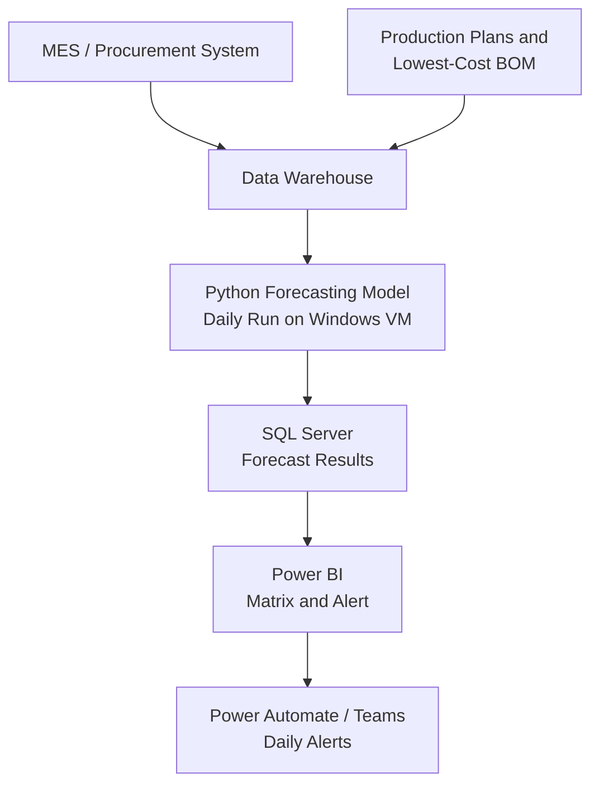

**English** | [繁體中文](README_ZH-TW.md)

# Raw Material Inventory Forecasting and Stockout Alert System

This project integrates cross-system data to forecast daily changes in future raw-material inventory, enabling early identification of potential material shortages and timely response actions.

## Purpose

Successfully implementing the lowest-cost BOM requires not only a reliable data foundation provided by the [Lowest-Cost BOM Data and Decision Platform](https://github.com/ChienChienChien/BOM_Management_Platform/blob/main/README.md), but also the operational readiness to execute the selected BOM during actual production.

By integrating inventory, purchase orders, inbound receipts, production plans, and BOM data, the project establishes daily inventory forecasts and tiered alerts for the next three months. This enables cross-functional teams to expedite materials or adjust production plans in advance, ensuring that the raw-material requirements of the lowest-cost BOM can be met.

## Outcomes

The system is live and runs daily, transforming raw material management from a periodic manual process into a decision workflow based on daily data refreshes, rolling forecasts, and exception alerts.

### Identify Stockout Risks with Tiered Alerts

💡 Convert stockout risks into clear handling priorities

The system classifies risk urgency based on the expected stockout date:

- **15-day alert:** There is still time to close the projected gap through procurement, supplier follow-up, or expedited delivery.
- **3-day alert:** A stockout is imminent and requires immediate expediting or production rescheduling.

<table>
  <tr>
    <td align="center" width="35%">
       
      Inventory exception alert
    </td>
    <td align="center" width="65%">
       
      Near-term stockout alert: shows at-risk materials, expected stockout dates, and handling priorities
    </td>
  </tr>
</table>

The alert framework helps users answer the following questions:

- Which raw materials are at risk of shortage?
- When is the shortage expected to occur?
- Is the issue caused by insufficient total inventory or by materials that have not yet been released for use?
- How much response time remains?
- Which items should be prioritized?

### Raw Material Inventory Forecast Matrix

💡 Build a daily view of raw material movements for the next three months

It consolidates expected daily raw material delivery, forecast consumption, and inventory into a single matrix, using color coding to flag warning and shortage conditions so users can quickly identify at-risk raw materials and the dates on which issues will occur.

Orange indicates that forecast inventory is below the alert threshold for the day (set to 200 in this example); red indicates that forecast inventory is below zero.

<table>
  <tr>
    <td align="center" width="100%">
       
    </td>
  </tr>
</table>

Some materials must undergo trial melting, composition verification, and release procedures after receipt before they can be used in production. Reviewing only the recorded inventory may therefore indicate sufficient quantities even when the materials have not yet been released for production.

To reflect these operational requirements, the project uses two management metrics: Total Inventory and Available Inventory. This ensures that the forecast matrix represents not only the recorded quantity but also whether the materials can actually be used in production.

### Inventory Forecast Trend

💡 Identify when inventory gaps are expected to emerge

The trend view places current inventory, expected receipts, forecast consumption, and safety-stock levels on a single timeline, enabling users to understand overall inventory movements and identify when shortages are expected to emerge.

<table>
  <tr>
    <td align="center" width="100%">
       
    </td>
  </tr>
</table>

### From Manual Consolidation to Daily Automated Monitoring

Previously, one person spent approximately three hours each week consolidating data and forecasting inventory. The process is now fully automated each day—covering data collection, supply-and-demand forecasting, result updates, and Teams alert notifications—without any manual initiation.

It currently covers more than 50 raw materials representing approximately NT$1 billion in monthly material costs and continuously supports material supply and production scheduling decisions.

## Approach

### 1. Define the Raw Material Forecast Matrix and Data Sources

Worked with cross-functional teams to define the business logic for procurement, consumption, and inventory, and mapped data sources across MES, procurement systems, production plans, and the lowest-cost BOM. This clarified each dataset’s update frequency and business definitions, enabling data dispersed across different systems to be aligned within a single forecasting matrix.

| Matrix Field | Data or Calculation Basis | Analytical Purpose |
|---|---|---|
| Opening Inventory | Current inventory quantity and material status (MES) | Establish the starting point for the inventory forecast |
| Procurement  |Purchase quantity and expected receipt date (MES and procurement system) | Estimate future replenishment |
| Consumption | Production plans and lowest-cost BOM | Estimate raw material demand by date |
| Inventory | Daily calculation based on opening inventory, planned procurement, and forecast consumption | Determine whether the overall material quantity is sufficient |
| Available Inventory | Total inventory excluding controlled quantities pending inspection or release | Determine whether the material can actually be used in production |

### 2. Integrate Data and Build the Raw Material Inventory Forecasting Model

- Collaborated with the IT team to integrate inventory, purchasing, and inbound-delivery data from MES and procurement systems into the data warehouse.
- Implemented the business logic in Python to build a raw-material inventory forecasting model.
- Automated the daily refresh of raw-material inventory forecasts and wrote the results to SQL Server.

### 3. Build a Power BI Decision-Support Platform for Inventory Forecasting

- Stockout alert matrix
- Raw Material Inventory Forecast Matrix
- Inventory Forecast Trend

### 4. Embed Analytical Results into Daily Decision-Making

Information is presented and delivered according to different decision scenarios:

- **Power BI:** Visualizes three-month supply-and-demand trends, daily inventory changes, expected shortage dates, and the underlying risk drivers.
- **Power Automate / Teams:** Automatically publishes a daily shortage-alert report each morning, enabling collaborating teams to prioritize material expediting and scheduling adjustments based on alert severity.

## Architecture

```mermaid
flowchart TD
    A["MES / Procurement System"]
    B["Production Plans and<br/>Lowest-Cost BOM"]
    C["Data Warehouse"]
    D["Python Forecasting Model<br/>Daily Run on Windows VM"]
    E["SQL Server<br/>Forecast Results"]
    F["Power BI<br/>Matrix and Alert"]
    G["Power Automate / Teams<br/>Daily Alerts"]

    A --> C
    B --> C
    C --> D
    D --> E
    E --> F
    F --> G
```

## Technology

| Capability | Technology | Use in the Project |
|---|---|---|
| Business Logic Modeling and Implementation | Python | Converts procurement, consumption, and material-release rules into daily supply-and-demand forecasts |
| System Execution and Operations | Windows VM | Runs daily schedules, data processing, and exception monitoring |
| Analytics and Decision Support | Power BI | Presents future supply and demand, inventory trends, and raw material risks |
| Workflow and Alert Automation | Power Automate, Teams | Distributes tiered alerts daily and embeds analytical results into raw material decisions |

## Confidentiality

This case study presents only de-identified business problems, analytical logic, and dashboard designs. It excludes proprietary company data, connection details, internal table names, complete business rules, and a directly reproducible runtime environment.
