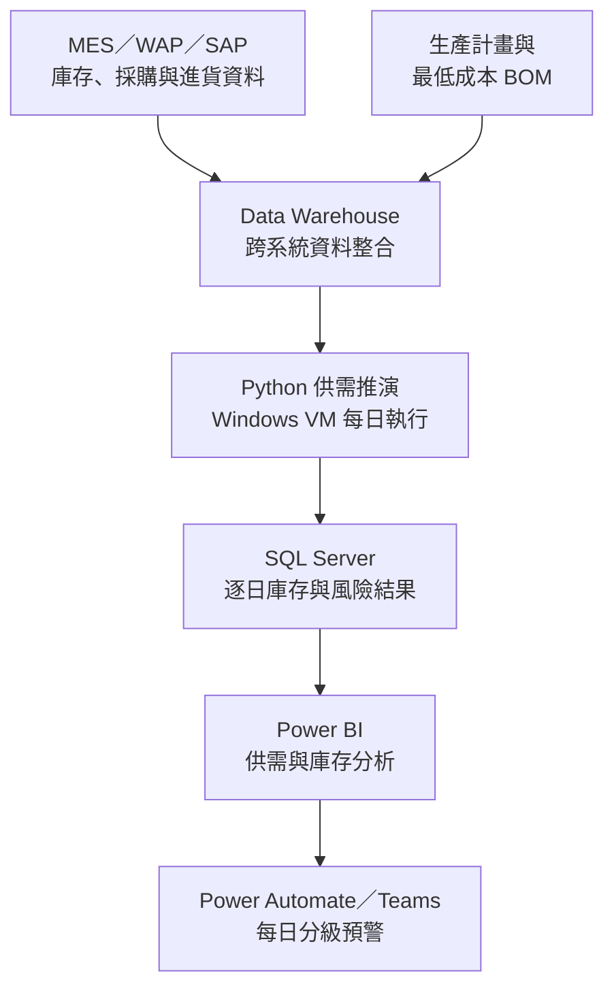
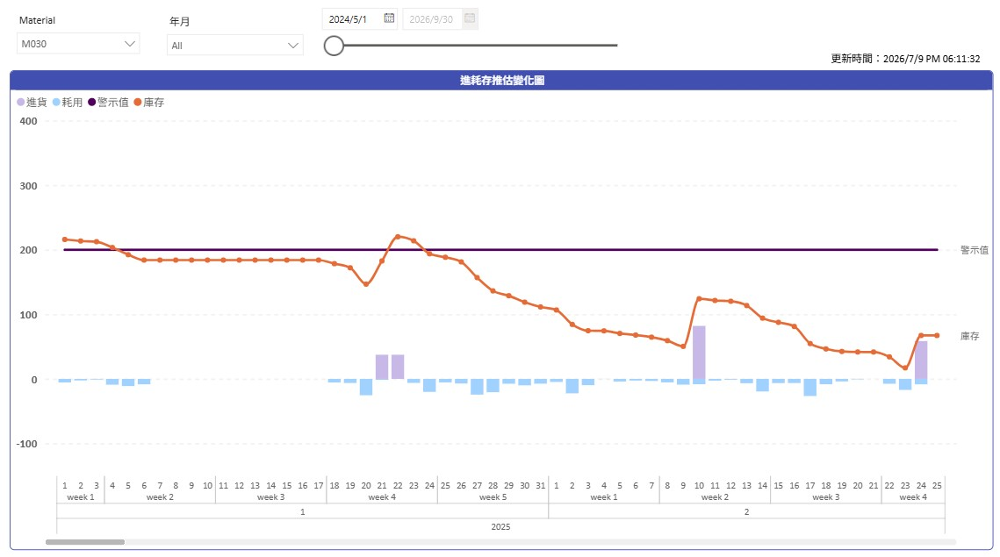
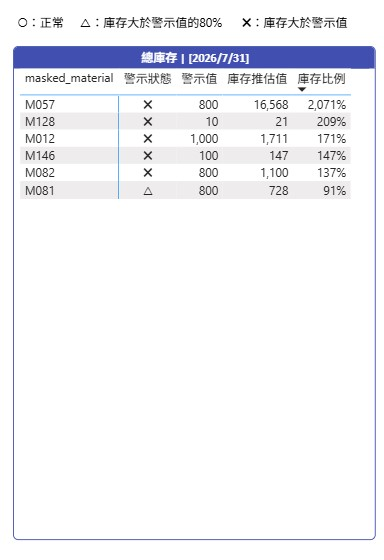
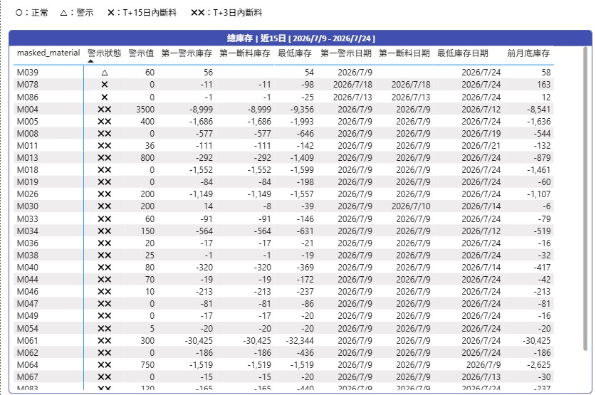
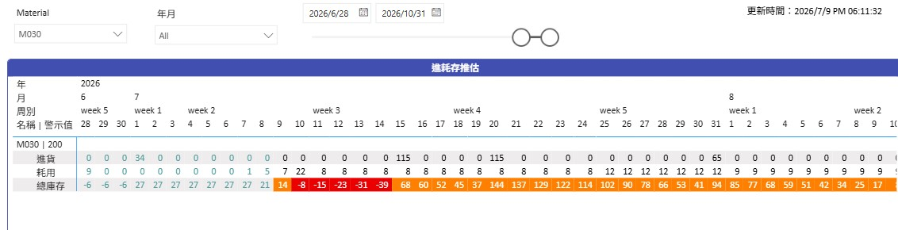

[English](README.md) | **繁體中文**

# 原料進耗存預測與庫存告警系統

本專案整合庫存、採購、進貨、生產計畫與 BOM 資料，逐日推演未來的原料庫存變化，以利提前識別斷料風險，並及早採取應對動作。

## 目的

最低成本 BOM 的落地，除了 [最低成本 BOM 資料與決策平台](https://github.com/ChienChienChien/BOM_Management_Platform/blob/main/README_ZH-TW.md) 提供穩定的資料基礎外，還須確保最低成本 BOM 在實際投料的時候可以被執行。

本專案整合庫存、採購、進貨、生產計畫與 BOM 資料，建立未來三個月的逐日供需推演與分級預警機制，協助運籌單位提前追料或調整生產計畫，降低原料供應不足對最低成本投料配置的影響。

## 成果

系統已正式上線並每日運作，將原料管理從定期人工整理，轉為以每日更新、滾動預測及例外預警為基礎的決策流程。

### 建立未來三個月的供需視角

系統每天根據最新的庫存、採購、進貨、生產計畫與 BOM 資料，逐日推演未來三個月的原料進貨、耗用及庫存變化。

原料管理因此不再停留於當前庫存快照，而能進一步掌握各項原料可能發生缺口的日期，評估其是否足以支應預定的投料需求。

### 將缺料風險轉換為決策窗口

系統依據預計缺料時間區分風險的急迫程度：

- **15 天預警：** 尚有機會透過採購、追蹤供應商或協調提前進貨補足需求。
- **3 天預警：** 代表風險已相當緊急，需要立即追料或調整生產排程。

預警結果不只指出哪些原料可能不足，也反映可採取行動的剩餘時間，協助運籌單位依風險急迫程度安排處理順序。

### 區分帳面庫存與實際可用性

部分廢鋼原料進貨後，仍須經過試熔、成分確認及解管程序，不能在進貨當下直接投入生產。若只檢視帳面庫存，可能出現庫存數量充足，但實際投料時原料尚未放行的情況。

因此，系統同時建立「總庫存」與「可用庫存」兩種管理視角，並分別設置警示條件，將原料檢驗與放行狀態納入風險判斷，提高供需分析與實際生產情境的一致性。

### 將人工整理轉為每日自動監控

原本每週需由一人投入約 3 小時整理資料與推估庫存，現已轉為每天自動完成資料取得、供需推演、結果更新及 Teams 警示發布，過程無須人工啟動。

目前系統涵蓋超過 50 種原料，每月原料成本規模約新台幣 10 億元，持續支援運籌單位的原料供應與生產排程決策。

## 作法

### 1. 將管理需求定義為分析問題

專案首先將運籌單位的管理需求，轉換為明確的分析問題：

> 每項原料能否在預定投料日期前，以可使用的狀態支應生產需求？

據此將分析粒度定義至「原料－日期」層級，並以未來總庫存、可用庫存、預計缺料日期及預警等級作為主要管理指標，讓分析結果能直接對應追料、採購及排程調整等行動。

### 2. 建立跨系統的原料供需資料模型

與 IT 單位協作，將 MES、WAP、SAP 中的庫存、採購及進貨資料整合至 Data Warehouse，再結合生產計畫與最低成本 BOM，建立一致的原料供需資料基礎。

透過跨系統資料整合，將當前庫存、未來進貨與預計耗用放在相同的時間軸上，避免使用者分別查找不同來源的資料，並確保供需推演採用一致的資料定義。

### 3. 將營運規則轉換為逐日推演邏輯

進貨日期、數量及原料管理規則由運籌單位提供，我負責釐清規則的適用條件，並將領域知識轉換為資料定義及可由程式執行的業務邏輯。

Python 程式每天取得最新資料，依據生產計畫與 BOM 展開原料需求，逐日計算未來三個月的進貨、耗用、總庫存與可用庫存變化。

對於進貨後仍須等待檢驗或放行的原料，系統不在進貨當下直接將其視為可用庫存，避免高估實際可供生產使用的原料數量。

### 4. 將分析結果嵌入日常決策流程

推演結果寫入 SQL Server，並由 Power BI 呈現原料供需、庫存趨勢、缺料日期及風險等級。

系統同時透過 Power Automate，每天早上自動將需要處理的例外項目發布至 Teams。運籌單位無須逐項檢查所有原料，而能直接針對系統辨識出的風險進行追料、提前進貨或生產排程調整。

藉由「每日資料更新－逐日供需推演－例外風險辨識－決策處理」的流程，將分析結果實際導入日常原料管理。

## 我的角色

我主導需求釐清、跨系統資料整合、業務規則轉譯、逐日供需推演程式、SQL 資料模型、Power BI 儀表板、Teams 告警，以及系統上線、排程與後續維護。

其中，進貨日期與數量等管理規則由運籌單位提供，我負責將規則轉換為可運算的資料邏輯，並完成程式實作與系統整合；最低成本 BOM 核心模型則由其他同仁負責。

## 架構

整體架構以 Data Warehouse 作為跨系統資料基礎，由 Python 每日執行未來三個月的逐日供需推演，再將結果寫入 SQL Server。

Power BI 提供完整的供需與庫存分析；Power Automate 則將需要處理的例外項目發布至 Teams，分別支援趨勢分析與即時風險應對。

各元件職責、預測資料流與告警流程請見[詳細系統架構](docs/architecture.md)。

## 報表畫面

### 庫存預測趨勢

呈現目前庫存、預計進貨、預估耗用及安全水位，判斷可能缺料的時間點。

### 庫存異常警示

彙整需要優先處理的原料及風險等級。

### 近期斷料警示

列出短期缺料項目、預計發生日期及處理優先順序。

### 每日預估明細

按日呈現庫存、進貨、耗用及預估結果，供異常追查。

## 技術

| 能力 | 使用技術 | 專案用途 |
|---|---|---|
| 資料整合與建模 | MES、WAP、SAP、Data Warehouse、SQL Server | 整合跨系統資料，建立原料供需與逐日庫存資料模型 |
| 業務規則與資料處理 | Python、Pandas | 將進貨、耗用及原料放行規則轉換為逐日供需推演 |
| 系統執行與維運 | Windows VM | 執行每日排程、資料處理及例外監控 |
| 分析與決策支援 | Power BI | 呈現未來供需、庫存趨勢及原料風險 |
| 流程與告警自動化 | Power Automate、Teams | 每日發布分級預警，將分析結果導入運籌決策流程 |

## 保密說明

本案例僅呈現去識別化的問題、分析邏輯與報表設計，不含公司原始資料、連線資訊、內部資料表名稱、完整規則及可直接重現的執行環境。
