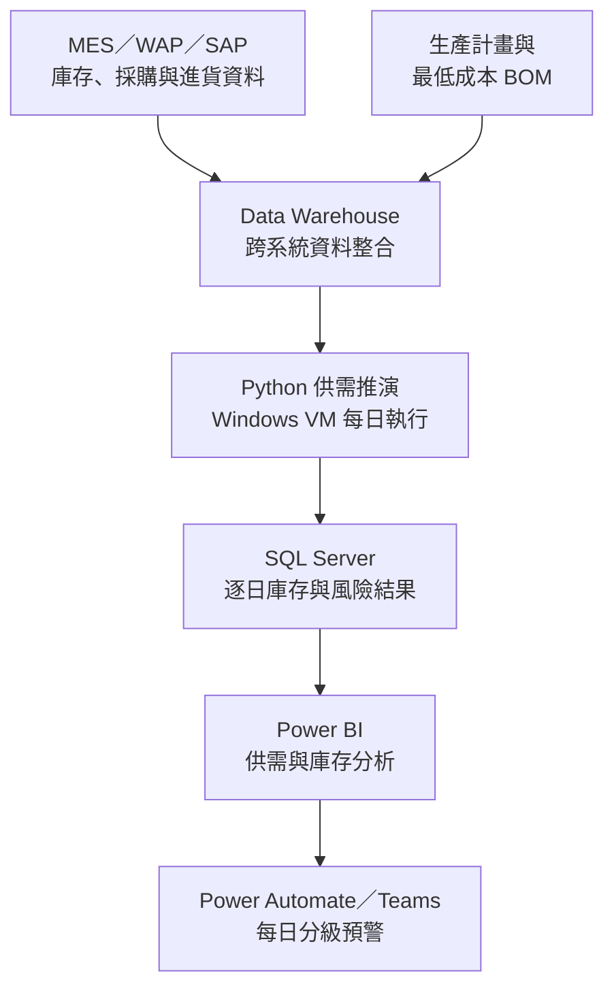

[English](README.md) | **繁體中文**

# 原料進耗存預測與庫存告警系統

本專案整合庫存、採購、進貨、生產計畫與 BOM 資料，逐日推演未來的原料庫存變化，以利提前識別斷料風險，並及早採取應對動作。

## 目的

最低成本 BOM 的落地，除了 [最低成本 BOM 資料與決策平台](https://github.com/ChienChienChien/BOM_Management_Platform/blob/main/README_ZH-TW.md) 提供穩定的資料基礎外，還須確保最低成本 BOM 在實際投料的時候可以被執行。

本專案整合庫存、採購、進貨、生產計畫與 BOM 資料，建立未來三個月的逐日供需推演與分級預警機制，協助現場單位提前追料或調整生產計畫，以滿足最低成本 BOM 的原料需求。

## 成果

系統已正式上線並每日運作，將原料管理從定期人工整理，轉為以每日更新、滾動預測與例外預警為基礎的決策流程。

### 採分級制度識別缺料風險

系統依據預計缺料時間區分風險的急迫程度：

- **15 天預警：** 尚有機會透過採購、追蹤供應商或協調提前進貨補足需求。
- **3 天預警：** 即將斷料，需要立即追料或調整生產排程。

<table>
  <tr>
    <td align="center" width="35%">
       
      庫存異常警示
    </td>
    <td align="center" width="65%">
       
      近期斷料警示：呈現短期缺料項目、預計發生日期與處理順序
    </td>
  </tr>
</table>

### 原料進耗存推估矩陣

將原料進耗存推估數字忠實呈現於推估矩陣中，並以顏色標記庫存狀態。

橙色為當日預估庫存小於警示值 (圖例中警示值為200)；紅色為當日預估庫存小於 0 。

部分原料入庫後仍須經過試熔、成分確認及解管程序，才能投入生產。若只檢視帳面庫存，可能出現數量充足，但實際投料時原料尚未放行的情況。
故本專案因應不同的原料管理需求，建立「總庫存」與「可用庫存」兩種管理指標，確保 `原料進耗存推估矩陣` 依循實務上的管理邏輯。

<table>
  <tr>
    <td align="center" width="35%">
       
      
    </td>
  </tr>
</table>

### 庫存預估趨勢圖

庫存預估趨勢：將目前庫存、預計進貨、預估耗用與安全水位呈現在同一條時間軸上，以全局的角度檢視庫存水位的變化。

<table>
  <tr>
    <td align="center" width="35%">
       
      
    </td>
  </tr>
</table>

### 將人工整理轉為每日自動監控

原本每週需由一人投入約 3 小時整理資料與推估庫存，現已轉為每天自動完成資料取得、供需推演、結果更新及 Teams 警示發布，全程無須人工啟動。

目前系統涵蓋超過 50 種原料，每月原料成本規模約新台幣 10 億元，持續支援運籌單位的原料供應與生產排程決策。

## 作法

### 1. 定義原料進耗存推估矩陣與資料來源

與協作單位定義進貨、耗用以及庫存的業務邏輯，並盤點 MES、採購系統、生產計畫及最低成本 BOM 等資料來源，釐清各項資料的更新頻率、時間欄位及業務定義，使分散在不同系統中的資料能夠對應至同一套推估矩陣。

| 定義項目 | 納入資料 | 分析用途 |
|---|---|---|
| 期初庫存 | 當前庫存數量與原料狀態 (MES) | 作為庫存推估的計算起點 | 
| 進貨 | 採購數量、預計進貨日期 (MES及採購系統) | 評估未來可補充的供應量 | 
| 耗用 | 生產計畫與最低成本 BOM 展開結果 | 推估各日期的原料需求 | 
| 總庫存 | 庫存、進貨與耗用的逐日變化 (MES) | 判斷原料整體數量是否足夠 | 
| 可用庫存 | 納入檢驗、試熔及放行條件後的庫存 (MES) | 判斷原料能否實際投入生產 |

### 2. 整合資料與建立原料進耗存推估模型

確立推估矩陣後，與 IT 單位協作，將 MES、WAP、SAP 中的庫存、採購與進貨資料整合至 Data Warehouse，再結合生產計畫及最低成本 BOM 展開後的原料需求。

資料整合過程先統一原料代碼、日期與數量定義，再將資料整理為三項基礎要素：

- **目前可支配的原料：** 各項原料的期初庫存及使用狀態。
- **未來可能增加的原料：** 已安排的採購與預計進貨數量。
- **未來預計消耗的原料：** 依生產計畫與 BOM 展開的逐日需求。

Python 程式每天取得最新資料，依日期順序加入預計進貨、扣除預估耗用，滾動推演未來三個月的每日庫存變化。

部分原料進貨後仍須經過試熔、成分確認及解管程序，因此模型同時推估「總庫存」與「可用庫存」。尚未符合放行條件的原料會計入總庫存，但不會立即計入可用庫存，避免帳面數量高估實際供應能力。

此階段將跨系統的營運資料轉換為一致的逐日供需結果，使使用者能看見每項原料未來的進貨、耗用與庫存變化。

### 3. 定義缺料風險以及警示等級

完成逐日推估後，下一步是將庫存變化轉換成可以安排處理順序的風險訊號。

系統分別檢視總庫存與可用庫存，辨識各項原料第一次無法支應需求的日期。這項判斷不只考量原料數量是否足夠，也納入原料能否在預定投料日期前完成檢驗與放行。

再根據預計缺料日期與當日的時間距離，將風險分為不同警示等級：

- **15 天預警：** 尚有機會透過追蹤供應商、協調提前進貨或調整採購安排補足需求。
- **3 天預警：** 代表缺料風險已相當緊急，需要立即追料或評估調整生產排程。

因此，模型的輸出不再只是每日庫存數量，而是進一步回答：

- 哪一項原料可能不足？
- 預計在哪一天發生缺口？
- 是總量不足，還是原料尚未達到可用狀態？
- 距離缺料還有多少處理時間？
- 應該優先處理哪些項目？

此階段將供需推估結果轉換為具有急迫程度與處理順序的管理資訊。

### 4. 將分析結果嵌入日常決策流程
最後，將每日進耗存、預計缺料日期及警示等級寫入 SQL Server，並依照不同的決策情境設計資訊呈現與傳遞方式。

- **Power BI：** 呈現未來三個月的供需趨勢、每日庫存變化、缺料日期與風險原因，支援整體監控及異常追查。
- **Power Automate／Teams：** 每天早上主動發布需要處理的例外項目，使運籌單位能依警示等級安排追料與排程調整。

整體流程形成：

> 資料每日更新 → 產生逐日進耗存矩陣 → 辨識預計缺料日期 → 判定警示等級 → 發布例外項目 → 執行追料或排程調整

運籌單位不再需要人工整合跨系統資料或逐項檢查所有原料，而能直接從系統辨識出的高風險項目開始處理，將分析結果轉換為可持續執行的日常決策流程。

## 架構

整體架構以 Data Warehouse 作為跨系統資料基礎，由 Python 每日執行未來三個月的逐日供需推演，再將結果寫入 SQL Server。

Power BI 提供完整的供需與庫存分析；Power Automate 則將需要處理的例外項目發布至 Teams，分別支援趨勢分析與即時風險應對。

各元件職責、預測資料流與告警流程請見[詳細系統架構](docs/architecture.md)。

## 技術

| 能力 | 使用技術 | 專案用途 |
|---|---|---|
| 資料整合與建模 | MES、WAP、SAP、Data Warehouse、SQL Server | 整合跨系統資料，建立原料供需與逐日庫存資料模型 |
| 業務規則與資料處理 | Python、Pandas | 將進貨、耗用及原料放行規則轉換為逐日供需推演 |
| 系統執行與維運 | Windows VM | 執行每日排程、資料處理及例外監控 |
| 分析與決策支援 | Power BI | 呈現未來供需、庫存趨勢及原料風險 |
| 流程與告警自動化 | Power Automate、Teams | 每日發布分級預警，將分析結果導入運籌決策流程 |

## 保密說明

本案例僅呈現去識別化的問題、分析邏輯與報表設計，不含公司原始資料、連線資訊、內部資料表名稱、完整規則及可直接重現的執行環境。
