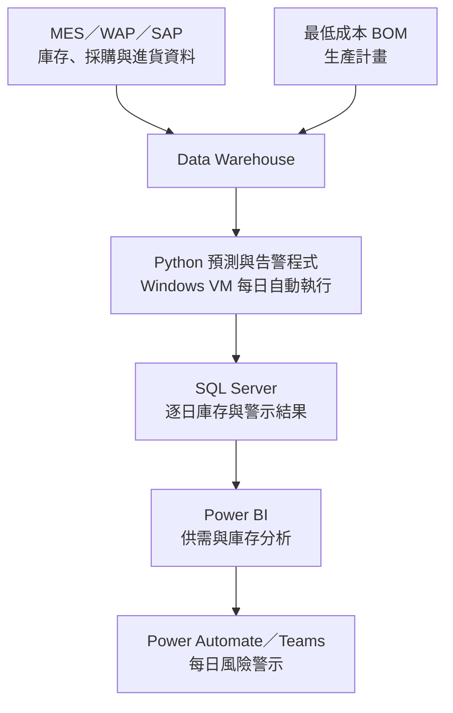

[English](README.md) | **繁體中文**

# 原料進耗存預測與庫存告警系統

> 整合庫存、採購、進貨、生產計畫與最低成本 BOM，每日推演未來三個月的原料供需，協助運籌單位在實際投料前辨識斷料風險。

## 目的

過去使用固定 BOM 時，每月的原料需求相對穩定，原料管理主要著重於既定用料規劃。隨著原料成本管理要求提高，公司導入最低成本 BOM，依據原料價格與限制條件動態調整投料組合，以提升成本競爭力。

然而，動態 BOM 也提高了生產對個別原料供應的敏感度。任何一項原料不足，都可能限制最低成本投料組合的執行，進而影響整體原料成本。除了確認原料是否已經進廠，更需要判斷其能否在實際投料時點完成檢驗並成為可用庫存。

因此，本專案建立每日自動化的原料進耗存推演與告警機制，整合跨系統資料，預測未來三個月的原料供需變化，協助運籌單位提前追料或調整生產計畫。

## 成果

- **將人工推估轉為每日自動化管理：** 原本每週需由一人花費約 3 小時整理與推估的作業，改為每天自動完成資料整合、庫存推演與警示發布，全程無須人工介入。

- **將庫存管理視野延伸至未來三個月：** 系統每天依據最新的庫存、採購、進貨、生產計畫與 BOM 資料，逐日推演未來三個月的原料供需，讓管理人員不再只看到當前庫存。

- **依處理時效區分風險層級：** 提前 15 天發現的風險，仍有機會透過採購或提前進貨處理；進入提前 3 天的警示範圍，則代表風險已相當緊急，需要立即追料或調整生產排程。

- **同時監控總庫存與可用庫存：** 除了檢視帳面上的原料總量，也將檢驗、試熔與解管程序納入考量，更嚴謹地辨識實際投料時可能發生的斷料風險。

- **支援大規模原料管理：** 系統涵蓋超過 50 種原料，每月原料成本規模約新台幣 10 億元，並已正式上線供運籌單位每日使用。

## 作法

### 1. 建立跨系統的原料供需資料基礎

與 IT 單位協作，將 MES、WAP、SAP 等系統中的庫存、採購與進貨資料整合至 Data Warehouse，再結合生產計畫與最低成本 BOM，建立一致的原料供需計算基礎。

### 2. 將管理規則轉換為可運算的業務邏輯

根據運籌單位提供的進貨與原料管理規則，將不同來源、時間尺度與管理條件轉換為可由程式執行的計算邏輯，據此推估每日進貨、耗用與庫存變化。

系統每天重新取得最新資料並推演未來三個月，使預測結果能隨採購進度、生產計畫與 BOM 需求同步更新。

### 3. 分別管理總庫存與可用庫存

部分廢鋼原料在進貨後，仍須經過試熔、成分確認與解管程序才能投入生產。因此，系統分別建立兩種庫存視角：

- **總庫存：** 反映原料整體存量及預計進貨。
- **可用庫存：** 只計入已完成必要程序、可實際投入生產的原料。

兩種庫存各自設有警示規則，避免帳面庫存充足，但實際投料時原料尚未放行的情況。

### 4. 建立自動化風險告警與處理機制

系統依照推演結果判斷各項原料的總庫存與可用庫存風險，並於每天早上自動發布 Teams 警示。

運籌單位可根據警示時間與風險程度，採取提前交貨、追蹤進料或調整生產計畫等行動，將原料管理從事後確認轉為事前應對。

> **我的角色：** 我主導跨系統資料整合、業務規則轉譯、庫存推演程式、資料模型、Power BI 儀表板、Teams 告警、上線排程及後續維護。進貨日期與數量的管理規則由運籌單位提供，我負責轉換為可運算邏輯並完成程式實作與系統整合。最低成本 BOM 核心模型由其他同仁負責。

## 架構

整體流程由 Data Warehouse 提供跨系統資料，Python 程式每日在 Windows VM 上執行未來三個月的逐日推演，並將結果寫入 SQL Server，供 Power BI 分析及 Teams 自動告警使用。

各元件職責、預測資料流與告警流程請見[詳細系統架構](docs/architecture.md)。

## 報表畫面

### 庫存預測趨勢

呈現目前庫存、預計進貨、預估耗用及安全水位，判斷可能缺料的時間點。

### 庫存異常警示

彙整需要優先處理的原料及風險等級。

### 近期斷料警示

列出短期缺料項目、預計發生日期及處理優先順序。

### 每日預估明細

按日呈現庫存、進貨、耗用及預估結果，供異常追查。

## 技術

| 能力 | 使用技術 | 專案用途 |
|---|---|---|
| 資料整合與儲存 | MES、WAP、SAP、Data Warehouse、SQL Server | 整合庫存、採購、進貨、生產計畫與 BOM 資料 |
| 業務邏輯與資料處理 | Python、Pandas | 執行進貨、耗用、總庫存與可用庫存的逐日推演 |
| 系統執行環境 | Windows VM | 執行每日排程、預測程式與例外處理 |
| 分析與決策支援 | Power BI | 呈現未來供需、庫存變化與原料風險 |
| 流程與告警自動化 | Power Automate、Teams | 每日自動發布分級庫存警示 |

## 保密說明

本案例僅呈現去識別化的問題、分析邏輯與報表設計，不含公司原始資料、連線資訊、內部資料表名稱、完整規則及可直接重現的執行環境。
