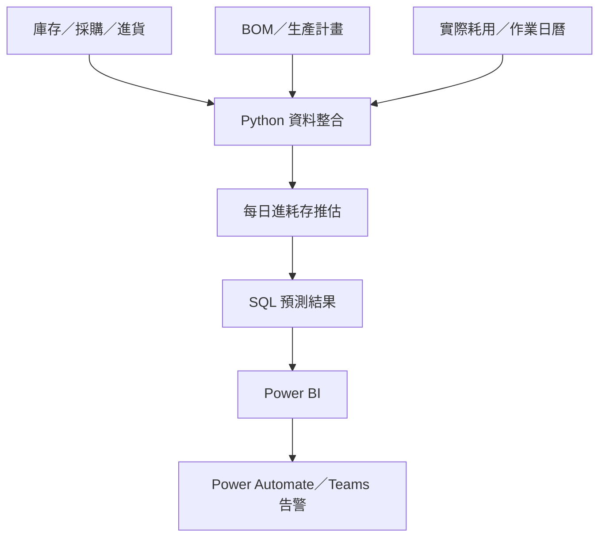

[English](README.md) | **繁體中文**

# 原料進耗存預測與庫存告警系統

將原料管理由當期庫存檢視延伸至未來供需預測，提供採購、生產與管理單位一致的備料及風險判斷依據。系統整合庫存、採購、BOM 與生產計畫，逐日推估未來三個月的進貨、耗用及庫存，支援超過 **50 種原料**、每月約 **新台幣 10 億元**的成本管理，並透過分級告警協助相關單位提前採取行動。

## 專案概況

| 項目 | 說明 |
|---|---|
| 業務範圍 | 原料採購、庫存及生產管理 |
| 個人職責 | 資料整合、預測邏輯、Power BI、告警流程 |
| 管理範圍 | 超過 50 種原料 |
| 成本規模 | 每月約新台幣 10 億元 |
| 預測期間 | 未來三個月，每日更新 |

## 問題

原料庫存、採購進度、實際耗用、BOM 與生產計畫分散於不同系統。僅查看當前庫存，無法判斷未來進貨能否支應生產需求；缺料若發現過晚，也會壓縮採購及排程調整時間。

## 作法

1. 整合庫存、管制庫存、採購、進貨、BOM、生產計畫及實際耗用。
2. 將各來源對齊至原料與日期維度。
3. 依短期排程及中期生產計畫推估每日耗用。
4. 加入預計進貨與庫存異動，逐日計算未來庫存。
5. 依安全水位及缺料時間分級告警。
6. 以 Power BI 呈現趨勢、風險清單及日別明細，並由 Teams 每日通知。

## 核心邏輯

```text
可用庫存 = 總庫存 - 管制庫存
```

```text
當日預估庫存 = 前日預估庫存 + 當日進貨 - 當日耗用
```

| 預測期間 | 耗用依據 |
|---|---|
| 近一週 | BOM 與實際生產排程 |
| 當月後續 | BOM、週生產計畫及工作天數 |
| 次月起 | BOM、月生產計畫及工作天數 |

## 系統架構



各元件職責、預測資料流與告警流程請見[詳細系統架構](docs/architecture.md)。

## 個人貢獻

- 整合跨系統原料、採購、庫存、BOM 及生產資料。
- 使用 Python 建立每日庫存推移與缺料判斷。
- 設計可供 Power BI 使用的資料模型。
- 建置庫存趨勢、風險清單及明細查詢頁面。
- 將告警結果轉為採購、生產及管理單位可執行的資訊。

## 成果

- 管理超過 **50 種原料**，每月成本規模約 **新台幣 10 億元**。
- 建立未來三個月的每日庫存預測。
- 將分散資料整合為共同的管理依據。
- 以分級告警協助採購及生產單位提前處理缺料風險。

## 報表畫面

### 庫存預測趨勢


呈現目前庫存、預計進貨、預估耗用及安全水位，判斷可能缺料的時間點。

### 庫存異常警示


彙整需要優先處理的原料及風險等級。

### 近期斷料警示


列出短期缺料項目、預計發生日期及處理優先順序。

### 每日預估明細


按日呈現庫存、進貨、耗用及預估結果，供異常追查。

## 使用技術

Python、Pandas、SQL、關聯式資料庫、Power BI、Power Automate、Teams。

## 保密說明

本案例僅呈現去識別化的問題、分析邏輯與報表設計，不含公司原始資料、連線資訊、內部資料表名稱、完整規則及可直接重現的執行環境。
