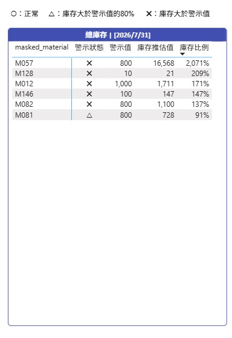
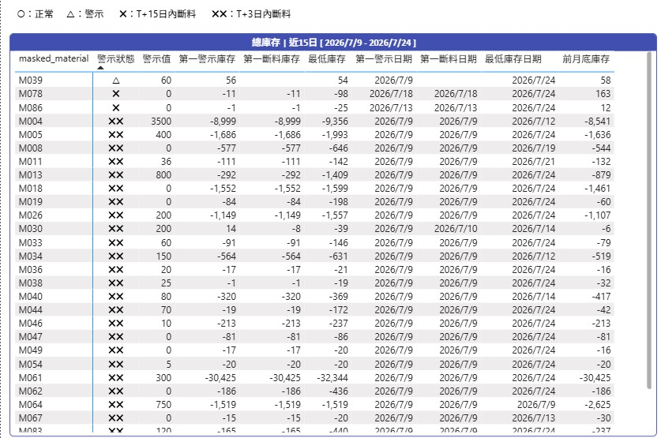
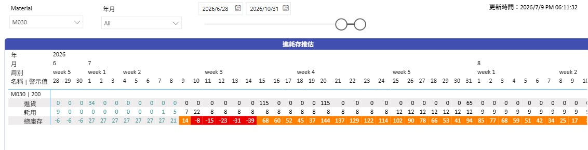
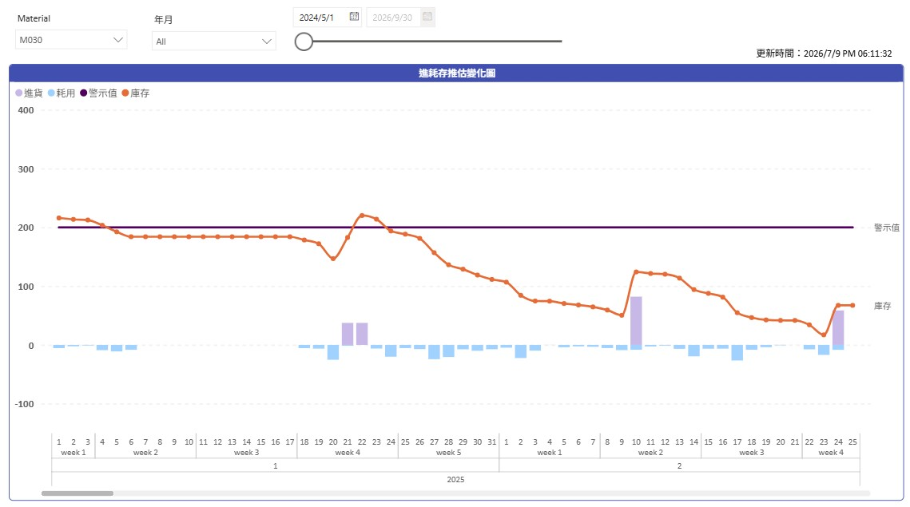
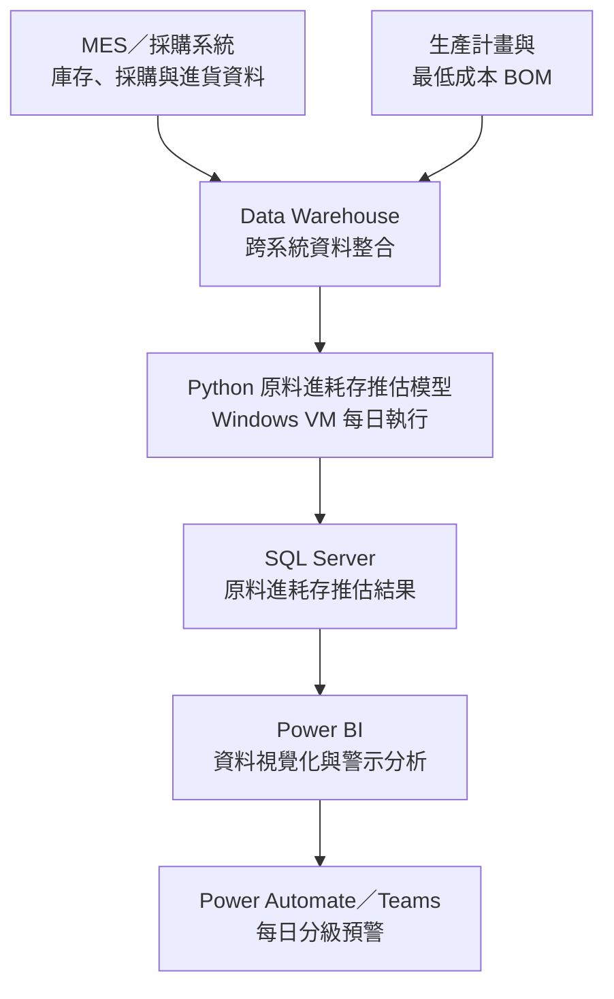

[English](README.md) | **繁體中文**

# 原料庫存推估與庫存告警系統

本專案整合跨系統之資料，逐日推估未來的原料庫存變化，以利提前識別斷料風險，並及早採取應對動作。

## 目的

最低成本 BOM 的落地，除了 [最低成本 BOM 資料與決策平台](https://github.com/ChienChienChien/BOM_Management_Platform/blob/main/README_ZH-TW.md) 提供穩定的資料基礎外，還須確保最低成本 BOM 在實際投料的時候可以被執行。

透過整合庫存、採購、進貨、生產計畫與 BOM 資料，建立未來三個月的逐日庫存推估與分級預警機制，協助協作單位提前追料或調整生產計畫，以滿足最低成本 BOM 的原料需求。

## 成果

系統已正式上線並每日運作，將原料管理從定期人工整理，轉為以每日更新、滾動推估與例外預警為基礎的決策流程。

### 採分級制度識別缺料風險

💡 將缺料風險轉換為處理優先順序

系統依據預計缺料時間區分風險的急迫程度：

- **15 天預警：** 尚有機會透過採購、追蹤供應商或協調提前進貨補足需求。
- **3 天預警：** 即將斷料，需要立即追料或調整生產排程。

<table>
  <tr>
    <td align="center" width="35%">
       
      庫存異常警示
    </td>
    <td align="center" width="65%">
       
      近期斷料警示：呈現短期缺料項目、預計發生日期與處理順序
    </td>
  </tr>
</table>

足以回答以下問題：

- 哪一項原料可能不足？
- 預計在哪一天發生缺口？
- 是總量不足，還是原料尚未達到可用狀態？
- 距離缺料還有多少處理時間？
- 應該優先處理哪些項目？

### 原料庫存推估矩陣

💡 建立未來三個月的逐日庫存推估視角

將每日預計進貨、預估耗用、總庫存與可用庫存整合於同一矩陣，並以顏色標示警戒與缺料狀態，讓使用者快速定位異常原料及發生日期。

橙色表示當日預估庫存低於警示值（圖例設定為 200）；紅色表示當日預估庫存低於 0。

部分原料入庫後仍須經過試熔、成分確認及解管程序，才能投入生產。若只檢視帳面庫存，可能出現數量充足，但實際投料時原料尚未放行的情況。
故本專案因應不同的原料管理需求，建立「總庫存」與「可用庫存」兩種管理指標，確保「原料庫存推估矩陣」依循實務上的管理邏輯。

<table>
  <tr>
    <td align="center" width="100%">
       
    </td>
  </tr>
</table>

### 原料庫存推估趨勢圖

💡 提前掌握庫存缺口的形成時間

將目前庫存、預計進貨、預估耗用與安全水位放在同一條時間軸上，協助使用者從整體視角掌握庫存水位變化及缺口形成時間。

<table>
  <tr>
    <td align="center" width="100%">
       
    </td>
  </tr>
</table>

### 將人工整理轉為每日自動監控

原本每週需由一人投入約 3 小時整理資料與推估庫存，現已轉為每天自動完成資料取得、供需推估、結果更新及 Teams 警示發布，全程無須人工啟動。

目前系統涵蓋超過 50 種原料，每月原料成本規模約新台幣 10 億元，持續支援原料供應與生產排程決策。

## 作法

### 1. 定義原料庫存推估矩陣與資料來源

與協作單位定義進貨、耗用以及庫存的業務邏輯，並盤點 MES、採購系統、生產計畫及最低成本 BOM 等資料來源，釐清各項資料的更新頻率及業務定義，使分散在不同系統中的資料能夠對應至同一套推估矩陣。

| 矩陣欄位 | 資料或計算基礎 | 分析用途 |
|---|---|---|
| 期初庫存 | 當前庫存數量與原料狀態（MES）| 作為庫存推估的計算起點 | 
| 進貨 | 採購數量、預計進貨日期（MES 與採購系統）| 評估未來可補充的供應量 | 
| 耗用 | 生產計畫與最低成本 BOM 展開結果 | 推估各日期的原料需求 | 
| 總庫存 | 期初庫存、預計進貨與預估耗用的逐日計算結果 | 判斷原料整體數量是否足夠 | 
| 可用庫存 | 總庫存扣除尚未完成檢驗或放行的管制數量 | 判斷原料能否實際投入生產 |

### 2. 整合資料與建立原料庫存推估模型

- 與資訊單位協作，將 MES 與採購系統中的庫存、採購與進貨資料整合至 Data Warehouse。
- Python 實作業務邏輯，建立原料庫存推估模型。
- 每日自動化更新原料庫存推估結果，並將結果寫入 SQL Server。

### 3. Power BI建立庫存推估決策平台

- 缺料警示報表
- 原料庫存推估矩陣
- 原料庫存推估趨勢圖

### 4. 將分析結果嵌入日常決策流程

依照不同的決策情境設計資訊呈現與傳遞方式：

- **Power BI：** 呈現未來三個月的供需趨勢、每日庫存變化、缺料日期與風險原因。
- **Power Automate／Teams：** 每天早上主動發布缺料警示報表，使協作單位能依警示等級安排追料與排程調整。

## 架構

```mermaid
flowchart TD
    A["MES／採購系統<br/>庫存、採購與進貨資料"]
    B["生產計畫與<br/>最低成本 BOM"]
    C["Data Warehouse<br/>跨系統資料整合"]
    D["Python 原料進耗存推估模型<br/>Windows VM 每日執行"]
    E["SQL Server<br/>原料進耗存推估結果"]
    F["Power BI<br/>資料視覺化與警示分析"]
    G["Power Automate／Teams<br/>每日分級預警"]

    A --> C
    B --> C
    C --> D
    D --> E
    E --> F
    F --> G
```

## 技術

| 能力 | 使用技術 | 專案用途 |
|---|---|---|
| 建模與實作商業邏輯 | Python | 將進貨、耗用及原料放行規則轉換為逐日供需推估 |
| 系統執行與維運 | Windows VM | 執行每日排程、資料處理及例外監控 |
| 分析與決策支援 | Power BI | 呈現未來供需、庫存趨勢及原料風險 |
| 流程與告警自動化 | Power Automate、Teams | 每日發布分級預警，將分析結果導入決策流程 |

## 保密說明

本案例僅呈現去識別化的問題、分析邏輯與報表設計，不含公司原始資料、連線資訊、內部資料表名稱、完整規則及可直接重現的執行環境。
