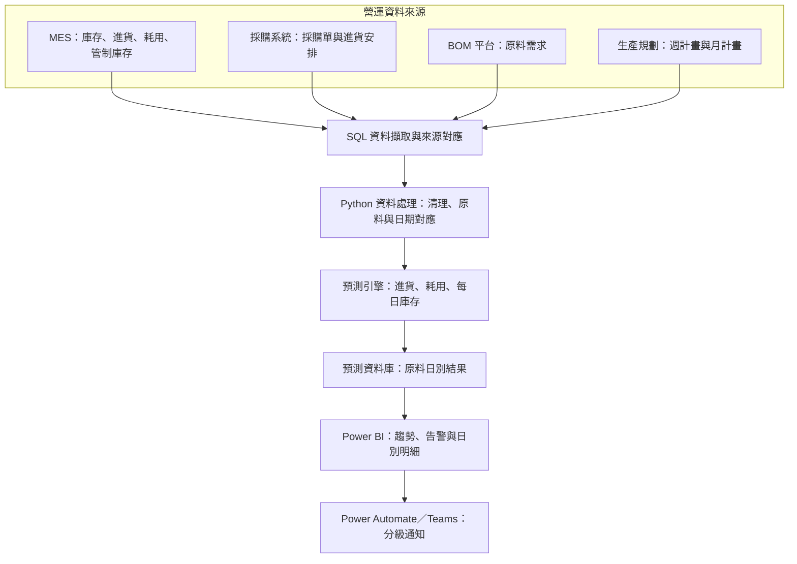
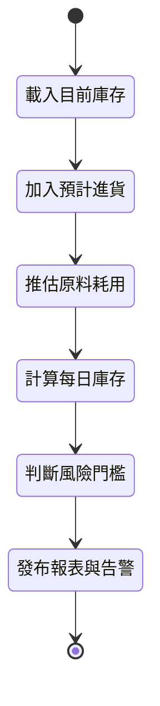
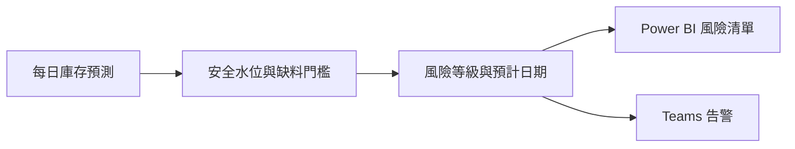

**繁體中文** | [English](architecture_en.md)

# 原料進耗存預測與庫存告警系統｜系統架構

## 整體架構

## 各層職責

| 元件 | 主要職責 |
|---|---|
| MES 資料 | 提供現有庫存、進貨、實際耗用及管制庫存 |
| 採購資料 | 提供採購單、預計交期與進貨安排 |
| BOM 平台 | 將生產需求轉換為各項原料需求 |
| 生產規劃 | 提供近期排程及中期週、月生產計畫 |
| SQL 資料擷取 | 讀取來源資料並對應跨系統識別欄位 |
| Python 資料處理 | 清理欄位，將資料統一至原料與日期維度 |
| 預測引擎 | 計算預計進貨、耗用及每日庫存餘額 |
| 預測資料庫 | 保存原料日別結果，供報表與告警使用 |
| Power BI／Teams | 呈現庫存風險並推送分級通知 |

## 預測流程

## 預測期間與資料依據

| 預測期間 | 主要耗用依據 |
|---|---|
| 近一週 | BOM 與實際生產排程 |
| 當月後續期間 | BOM、週生產計畫及工作天數 |
| 次月起 | BOM、月生產計畫及工作天數 |

此設計以近期排程提高短期預測精度，並以週、月計畫支援中期規劃。所有資料在計算前皆轉換為原料日別時間序列。

## 告警決策流程

- 趨勢圖呈現預估庫存接近警戒水位的時間點。
- 告警清單依風險等級及預計缺料日期排序。
- 日別明細提供進貨、耗用與庫存變化的追查依據。

## 圖示說明

- 實線箭頭代表主要資料與決策流程。
- 資料來源及欄位名稱均已去識別化。
- 未揭露公司專用規劃參數及完整計算規則。
