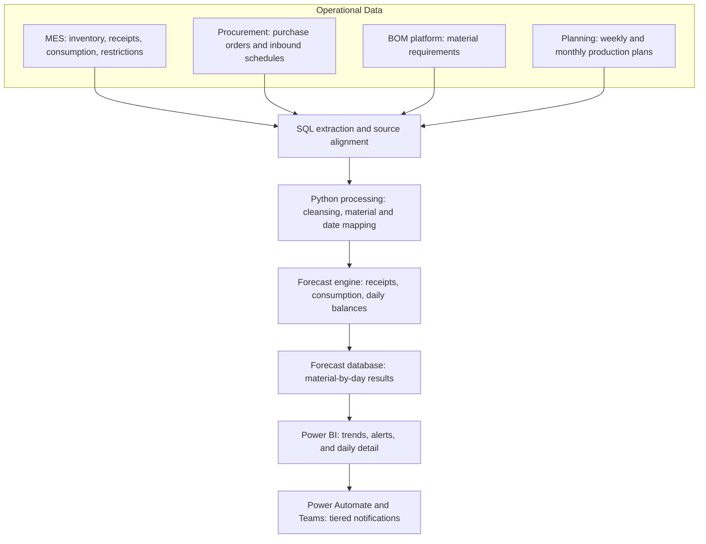
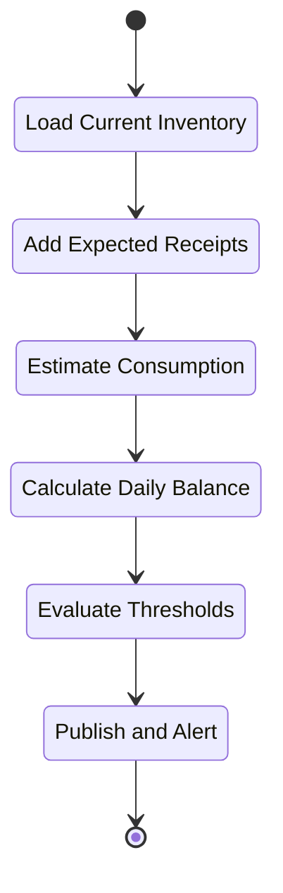
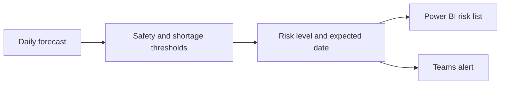

[繁體中文](architecture.md) | **English**

# Raw Material Inventory Forecasting | System Architecture

## End-to-End Architecture

## Component Responsibilities

| Component | Responsibility |
|---|---|
| MES data | Provides on-hand inventory, receipts, actual consumption, and restricted stock |
| Procurement data | Provides purchase orders, expected delivery dates, and inbound arrangements |
| BOM platform | Converts production requirements into material demand |
| Production planning | Provides near-term schedules and medium-term weekly or monthly plans |
| SQL extraction | Retrieves source data and aligns identifiers across systems |
| Python processing | Cleanses fields and maps all records to material and date dimensions |
| Forecast engine | Calculates expected receipts, consumption, and daily inventory balances |
| Forecast database | Stores material-by-day results for reporting and alerting |
| Power BI and Teams | Presents risk and distributes tiered notifications |

## Forecasting Flow

## Forecast Horizon

| Period | Primary demand input |
|---|---|
| Next week | BOM and actual production schedule |
| Remainder of current month | BOM, weekly production plan, and working days |
| Following months | BOM, monthly production plan, and working days |

This design combines detailed near-term scheduling with broader medium-term planning. All inputs are converted to a daily material-level time series before inventory balances are calculated.

## Decision Flow

- Trend views show when projected inventory approaches a threshold.
- Alert lists prioritize materials by risk level and expected shortage date.
- Daily detail supports follow-up on receipts, consumption, and balance changes.

## Diagram Notes

- Solid arrows indicate the primary data and decision flow.
- Source and field names are de-identified.
- Proprietary planning parameters and complete calculation rules are excluded.
